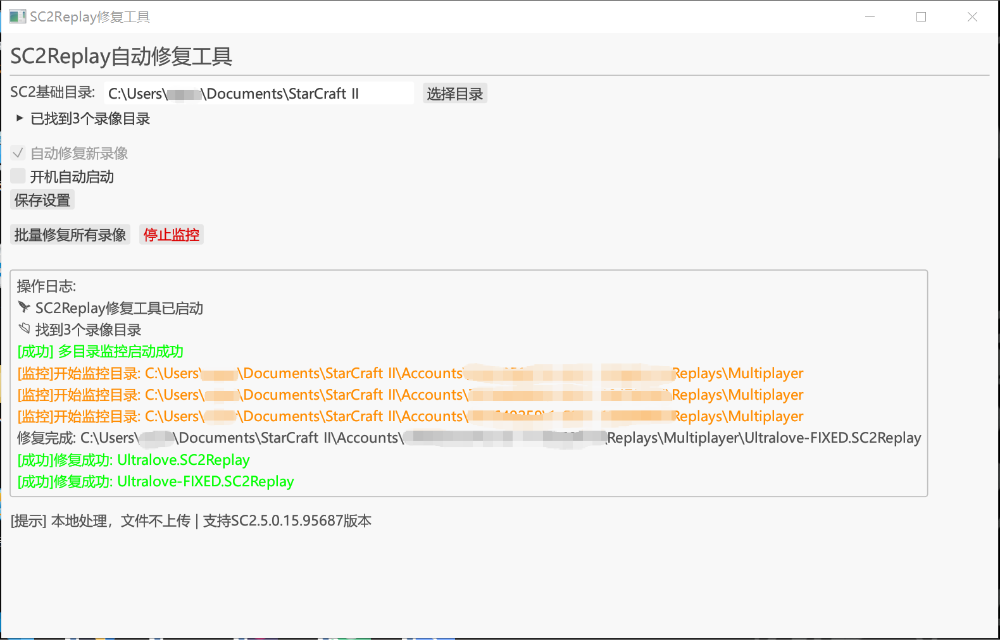
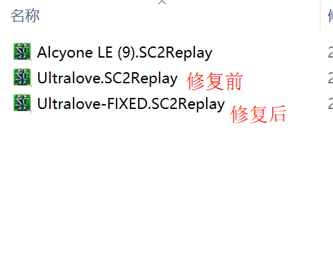

# SC2Replay_AutoFix

## 描述

用于星际争霸2 CN服的录像自动修复工具，支持版本SC2.5.0.15.95687
目前仅支持Windows没有对MacOS下的路径做适配

## 使用方式

打开sc2replay-autofix，程序会自动寻找目录。

当然你也可以手动指定星际争霸2的文档基础路径（注意是文档路径，而非安装路径，也不是录像路径），通常默认为`C:\Users\系统用户名\Documents\StarCraft II`。之所以这样做是因为录像路径的格式为`C:\Users\系统用户名\Documents\StarCraft II\Accounts\XXXXXXXXX\X-X-XXXXX\Replays\Multiplayer`，可能有多个账户，多个账户可能存在多个赛季不同的存放目录。

默认状态下，“自动修复新录像”的复选框是勾选的，只有勾选上才能点击“启动监控”按钮，监控功能启动后，一旦检测到录像文件夹中有新的录像生成就会自动修复，无需手动（注意你不点击“启动监控”按钮是不会进行自动修复的）。然后开游戏，打完一局后就会有后缀为`-FIXED`的录像生成，这个就是你这局修复后的录像。

“批量修复所有录像”的按钮是用来手动修复这几个目录下的所有录像。

本程序还支持开机自动启动功能，勾选后，点击“保存配置”，会写入注册表，以便开机时启动本程序。如果需要取消自启动功能，需取消勾选，并再次点击“保存配置”按钮。

如果录像名称后缀已经是`-FIXED`，那么会自动忽略此录像，即便此录像是没有经过修复的。